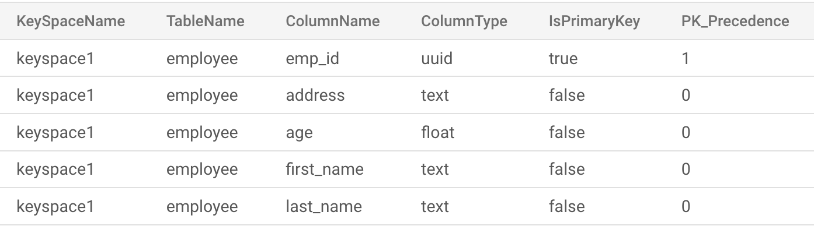

# Cassandra to Cloud Spanner Proxy Adapter
> [!NOTE] 
> We introduced the newer official [go-spanner-cassandra](https://github.com/googleapis/go-spanner-cassandra/blob/main/README.md) and [java-spanner-cassandra](https://github.com/googleapis/java-spanner-cassandra/blob/main/README.md) clients(currently in public preview). These clients enable in-process use of gocql (for Go) or the Java Cassandra driver with [Spanner's native v4 Cassandra protocol support](https://cloud.google.com/spanner/docs/non-relational/connect-cassandra-adapter), eliminating the need for running this proxy adapter as a sidecar.
## Current Released  Version

Version `1.1.0`

## Introduction
Cassandra to Cloud Spanner Proxy Adapter is designed to forward your application's CQL traffic to Spanner database service. It listens on a local address and securely forwards that traffic.

## Table of Contents
- [When to use cassandra-to-spanner-proxy?](#when-to-use-cassandra-to-spanner-proxy)
- [Prerequisites](#prerequisites)
- [Cloud Spanner Instructions](#cloud-spanner-instructions)
- [Getting started](#getting-started)
  - [Locally build and run](#locally-build-and-run)
  - [Run a `cassandra-to-spanner-proxy` via docker](#run-a-cassandra-to-spanner-proxy-via-docker)
  - [Use Kubernetes](#use-kubernetes)
- [Infrastructure Provisioning on GCP using Terraform](./deployment/infra-tf/README.md)
- [CQLSH support](./docs/cqlsh.md)
- [Stale Read Support](./docs/StaleRead.md)
- [Configuration Options](./docs/config_options.md)
- [Limitations for Proxy Application](#limitations-for-proxy-application)
- [Setting Up systemd](./systemd/Readme.md)
- [Instrument with OpenTelemetry](#instrument-with-opentelemetry)
- [Differences from Cassandra](./docs/differences_from_cassandra.md)
- [Run Unit/Integration tests locally](./docs/setup_ut_it.md)
- [Generating Mock Files Using Mockery](./mocks/README.md)
- [Frequently Asked Questions](./docs/faq.md)
## When to use cassandra-to-spanner-proxy ?

`cassandra-to-spanner-proxy`  enables applications that are currently using Apache Cassandra or DataStax Enterprise (DSE) and would like to switch to use Cloud Spanner. This Proxy Adapter can be used as Plug-N-Play for the Client Application without the need of any code changes in the Client Application.

## Prerequisites

You will need a [Google Cloud Platform Console][developer-console] project with the Cloud Spanner [API enabled][enable-api].
You will need to [enable billing][enable-billing] to use Google Cloud Spanner.
[Follow these instructions][create-project] to get your project set up.

Ensure that you run

```sh
gcloud auth application-default login
```

to set up your local development environment with authentication credentials.

Set the GCLOUD_PROJECT environment variable to your Google Cloud project ID:

```sh
gcloud config set project [MY_PROJECT_NAME]
```

## Cloud Spanner Instructions

- Database and all the tables should be created in advance before executing the queries using the adapter.
- A table should be created as below which will have the metadata information of the cassandra tables and its columns.

    ```sql
        CREATE TABLE IF NOT EXISTS TableConfigurations (
            `KeySpaceName` STRING(MAX),
            `TableName` STRING(MAX),
            `ColumnName` STRING(MAX),
            `ColumnType` STRING(MAX),
            `IsPrimaryKey` BOOL,
            `PK_Precedence` INT64,
        ) PRIMARY KEY (TableName, ColumnName, KeySpaceName);
    ```


- Make sure to insert all the table and column information into the above table before running the application.

## Getting started

We can setup the `cassandra-to-spanner-proxy` adapter via 3 different methods as mentioned below

- Locally build and run `cassandra-to-spanner-proxy`
- Run a docker image that has `cassandra-to-spanner-proxy` installed
- Use a Kubernetes container to run `cassandra-to-spanner-proxy`


### Locally build and run

Steps to run the adapter locally are as mentioned below:

- Clone the repository (https://github.com/cloudspannerecosystem/cassandra-to-spanner-proxy.git)
- Update `config.yaml` (or set up the `CONFIG_FILE` environment variable with the appropriate config file path), to specify listeners, project, instance, database details as well as additional configuration like enabling/disabling OTEL, keyspace flattening , Spanner session related configuration etc. See [advanced config options](docs/config_options.md) for more details.
    ```yaml
    cassandra_to_spanner_configs:
    projectId: YOUR_PROJECT_ID
    configTableName: YOUR_CONFIG_TABLE_NAME
    keyspaceFlatter: True

    listeners:
    - name: YOUR_CLUSTER_NAME_1
        port: PORT_1
        spanner:
            instanceId: YOUR_SPANNER_INSTANCE_ID
            databaseId: YOUR_SPANNER_DATABASE

    ```

- Build the proxy application by running the below command on the root directory.
    ```sh
    CGO_ENABLED=0 GOOS=linux GOARCH=amd64 go build -o cassandra-to-spanner-proxy .
- Run the Application
    ```sh
    ./cassandra-to-spanner-proxy
- Optional Arguments with the default values.
  * **cql-version**: CQL version, **default value: "3.4.5"**
  * **partitioner**: Partitioner, **default value: "org.apache.cassandra.dht.Murmur3Partitioner"**
  * **release-version**: Release Version, **default value: "4.0.0.6816"**
  * **data-center**: Data center, **default value: "datacenter1"**
  * **protocol-version**: Initial protocol version to use when connecting to the backend cluster, **default value: v4**
  * **log-level**: , set log level - [info/debug/error/warn] **default value: info**
- Run the Application with the arguments example
    ```sh
    ./cassandra-to-spanner-proxy --log-level error
- Application will be listening on PORT **9042**.

### Run a `cassandra-to-spanner-proxy` via docker

- Build the docker image
    ```sh
    docker run -p 9042:9042 \
  -e GOOGLE_APPLICATION_CREDENTIALS="/var/run/secret/cloud.google.com/spanner-adaptor-service-account.json" \
  -v <<path to service account>>/spanner-adaptor-service-account.json:/var/run/secret/cloud.google.com/ \
  -d cassandra-spanner-proxy

    ```

### Use Kubernetes

- [Deployment via k8](./deployment/k8/README.md)

### Infrastructure provisioning on GCP using Terraform
- [Infrastructure provisioning on GCP](./deployment/infra-tf/README.md)

### CQLSH with proxy
 Users can connect and use `cqlsh` with the proxy. Detailed document -  [cqlsh.md](./docs/cqlsh.md)

## Limitations for Proxy Application

Detailed document - [Limitations](./docs/limitations.md)

### Run a `cassandra-to-spanner-proxy` via systemd.

Why systemd? - It can automatically restart crashed services, which is crucial for maintaining the availability of applications and system functions. systemd also provides mechanisms for service sandboxing and security.

Go through this document for setting up systemd for this project in your linux system - [Setting Up systemd](./systemd/Readme.md)

### Instrument with OpenTelemetry

The Proxy Adapter supports OpenTelemetry metrics and traces, which gives insight into the adapter internals and aids in debugging/troubleshooting production issues.

See [OpenTelemetry](otel/README.md) for integrating OpenTelemetry (OTEL) with Your Application

[developer-console]: https://console.developers.google.com/
[enable-api]: https://console.cloud.google.com/flows/enableapi?apiid=spanner.googleapis.com
[enable-billing]: https://cloud.google.com/apis/docs/getting-started#enabling_billing
[create-project]: https://cloud.google.com/resource-manager/docs/creating-managing-projects
[cloud-cli]: https://cloud.google.com/cli

## FAQ
See [Frequently Asked Questions](docs/faq.md) for answers to frequently asked questions.

## License

[Apache License 2.0](LICENSE)

## Getting Support

The Cassandra to Cloud Spanner Proxy Adapter is a [Cloud Spanner Ecosystem](https://www.cloudspannerecosystem.dev/about)
project  is maintained by the Google Spanner team. We'd love for you to
[report issues, file feature requests][new-issue], and [send pull requests][new-pr]
(see [Contributing](CONTRIBUTING.md)). You may file bugs and feature
requests using GitHub's issue tracker or using the existing Cloud Spanner
support channels.

[new-issue]: https://github.com/cloudspannerecosystem/cassandra-to-spanner-proxy/issues/new
[new-pr]: https://github.com/cloudspannerecosystem/cassandra-to-spanner-proxy/compare
